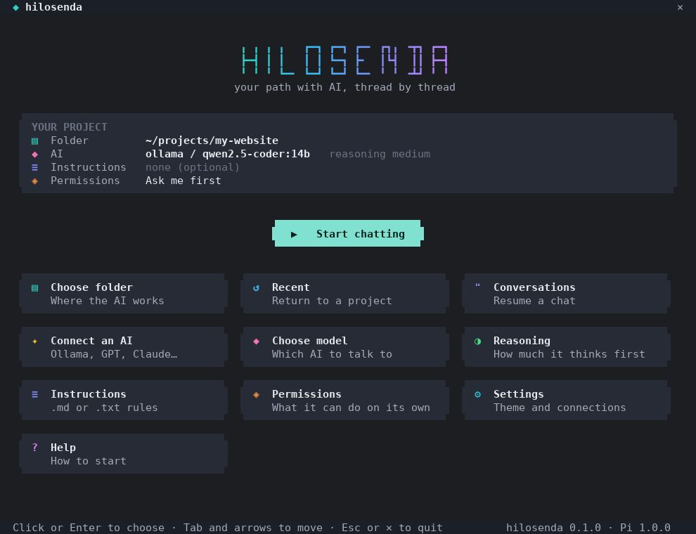
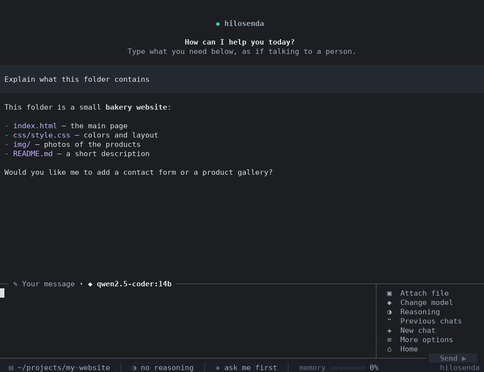
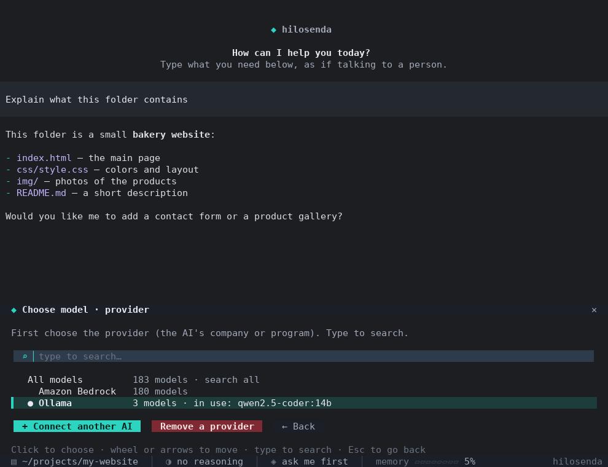
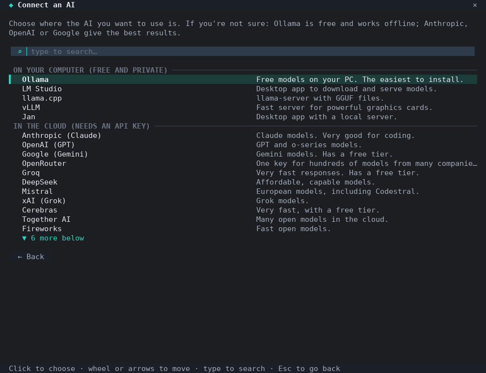
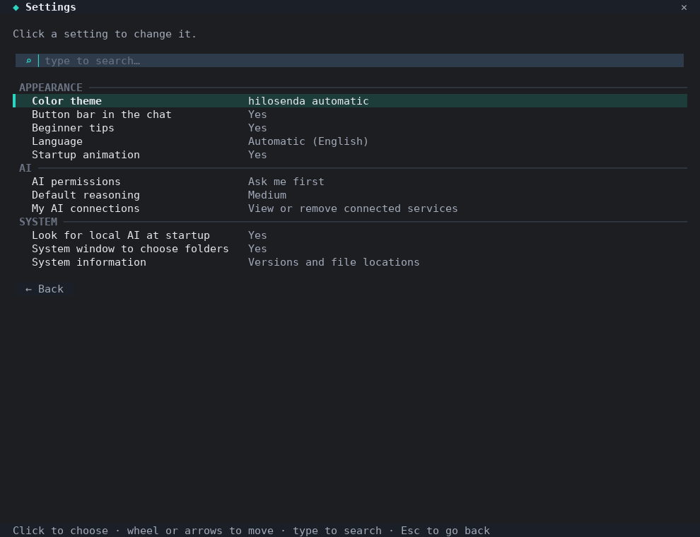
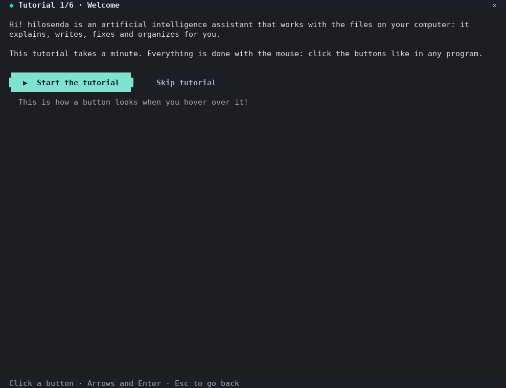

<p align="center"></p>

<h1 align="center">hilosenda</h1>

<p align="center"><b><a href="README.md">English</a> · <a href="README.es.md">Español</a> · <a href="README.pt.md">Português</a> · <a href="README.fr.md">Français</a> · <a href="README.de.md">Deutsch</a> · <a href="README.it.md">Italiano</a></b></p>

**Pi renovado: un asistente de IA para la consola que se usa con clics.**

hilosenda es una version "modeada" del agente de programacion [Pi](https://github.com/earendil-works/pi).
Sigue siendo un programa de consola, pero esta pensado para alguien que **nunca uso algo asi**:
todo se hace con botones y clics del raton, con explicaciones en español. Para quien ya conoce
Pi, **todos los comandos originales siguen funcionando** (escribe `/` dentro del chat).


## Capturas

<table>
<tr><td width="50%"><br><sub>Pantalla de inicio</sub></td><td width="50%"><br><sub>Chat con el panel lateral</sub></td></tr>
<tr><td width="50%"><br><sub>Elegir modelo por proveedor</sub></td><td width="50%"><br><sub>Conectar cualquier IA</sub></td></tr>
<tr><td width="50%"><br><sub>Ajustes (incluye idioma)</sub></td><td width="50%"><br><sub>Tutorial guiado la primera vez</sub></td></tr>
</table>

## Instalar

No necesitas instalar nada antes: si tu computadora no tiene Node.js, el instalador descarga
una copia privada solo para hilosenda. No pide permisos de administrador.

**Windows** (abre PowerShell y pega):

```powershell
powershell -ExecutionPolicy Bypass -c "irm https://raw.githubusercontent.com/bolivian12/hilosenda/main/install/install.ps1 | iex"
```

O descarga [`install/install.cmd`](install/install.cmd) y hazle doble clic. Se crea un acceso
directo **hilosenda** en el Escritorio y en el menu Inicio.

**macOS y Linux** (abre la Terminal y pega):

```sh
curl -fsSL https://raw.githubusercontent.com/bolivian12/hilosenda/main/install/install.sh | sh
```

En macOS aparece `hilosenda.command` en el Escritorio; en Linux, hilosenda aparece en el menu de
aplicaciones. Tambien puedes escribir `hilosenda` en cualquier terminal.

> Para instalar otra rama (por ejemplo, una version en pruebas) define `HILOSENDA_REF`:
> `curl -fsSL …/install.sh | HILOSENDA_REF=mi-rama sh`

Tambien puedes descargarlo con git y ejecutar el instalador desde ahi:

```sh
git clone https://github.com/bolivian12/hilosenda.git hilosenda
cd hilosenda
sh install/install.sh        # en Windows: powershell -ExecutionPolicy Bypass -File install\install.ps1
```

**NixOS**: el instalador lo detecta y obtiene Node.js con Nix (los programas genericos de Linux
no funcionan en NixOS). Si usas home-manager, agrega `~/.local/bin` a `home.sessionPath`.
Recomendado tambien: `fd` y `ripgrep` instalados con Nix, porque Pi los usa para buscar archivos.

Si ya tienes Node.js 22.19 o mas nuevo, tambien puedes instalarlo con npm:

```sh
npm install -g --ignore-scripts github:bolivian12/hilosenda
```

## Empezar en 3 pasos

1. **Conecta una IA.** Pulsa «Conectar una IA». Si tienes Ollama o LM Studio abiertos, se detectan
   solos. Si prefieres una IA en la nube (Claude, GPT, Gemini, OpenRouter...), pega tu clave API:
   hilosenda **detecta automaticamente todos los modelos disponibles**.
2. **Elige una carpeta.** Pulsa «Elegir carpeta» y se abre la ventana normal de tu sistema para
   elegirla: el selector de Windows, el de macOS o, en Linux, el de tu escritorio (GNOME, KDE,
   Hyprland...) a traves del portal de escritorio. Si no hay ventanas (por ejemplo por SSH), se
   abre un explorador dentro de la consola.
3. **Chatea.** Pulsa «Empezar a chatear», escribe lo que necesitas en lenguaje normal y pulsa Enter.

## Que trae

**Pantalla de inicio** (con animacion de entrada)
- Boton grande «Empezar a chatear» y botones para todo lo demas.
- Carpetas recientes y **conversaciones anteriores** con buscador por cualquier palabra.
- Aviso automatico si detecta IA instalada en tu computadora.

**Conectar cualquier IA, sin depender de un proveedor**
- En tu PC: Ollama, LM Studio, llama.cpp, vLLM, Jan.
- En la nube: Anthropic, OpenAI, Google Gemini, OpenRouter, Groq, DeepSeek, Mistral, xAI,
  Cerebras, Together, Fireworks, Moonshot, NVIDIA.
- Con tu cuenta: Claude Pro/Max, ChatGPT, GitHub Copilot (abre `/login` de Pi).
- **Cualquier otra direccion** compatible con OpenAI, Anthropic o Google: escribes la URL y
  hilosenda averigua el protocolo y lista sus modelos.
- Los modelos que Pi ya trae siguen apareciendo por defecto.

**Dentro del chat** (diseño tranquilo, pensado para quien empieza)
- Un saludo sencillo y tarjetas con ideas para empezar, que se envian con un clic.
- Barra de botones sencilla: Menu, Modelo, Nuevo chat e Inicio, y **Detener** mientras la IA
  trabaja. En Ajustes se puede activar la barra completa (razonamiento, permisos, instrucciones,
  carpeta, historial).
- **Menu** con todas las funciones de Pi explicadas en español (tambien con `F1`).
- Cambiar de carpeta sin salir: hilosenda reabre el chat en la nueva carpeta.
- El borrador que estabas escribiendo no se pierde al pulsar botones.

**Permisos**
- *Preguntarme antes* (por defecto): antes de crear o cambiar archivos o ejecutar comandos,
  aparece un cuadro con lo que la IA quiere hacer y botones «Permitir», «Permitir siempre en este
  chat», «No permitir» y «No, y decirle por que».
- *Libre*: como Pi original, sin preguntas.
- *Solo mirar*: la IA puede leer tu proyecto pero no cambiar nada.

**Instrucciones**
- Elige libremente cualquier archivo `.md` o `.txt` con reglas para la IA (idioma, estilo,
  tecnologias...). Se lee antes de cada respuesta, asi que puedes editarlo cuando quieras.

**Aspecto de aplicacion de escritorio**: botones con forma de pildora, tarjetas con esquinas
redondeadas que se iluminan al pasar el raton, barra de titulo con ✕, barra de estado inferior
clicable (modelo, razonamiento, carpeta, uso de memoria y costo) y temas propios claro y oscuro
para todo el chat.

**Ajustes**: tema (automatico, oscuro o claro), razonamiento por defecto, barra de botones,
consejos para principiantes, animacion, ventana del sistema para carpetas, conexiones guardadas.

### Idiomas

hilosenda habla español, English, Português, Français, Deutsch e Italiano. Usa
automaticamente el idioma de tu sistema (`LANG`, `LC_ALL`, o la configuracion regional de
Windows/macOS) y la IA responde en ese idioma. Puedes cambiarlo en **Ajustes → Idioma**.
Las traducciones estan en `src/idiomas/<codigo>.json`.

## Comandos

Todo se puede hacer con clics, pero tambien hay comandos en español:

| Comando | Que hace |
|---|---|
| `/menu` | Todas las funciones con explicaciones |
| `/modelo [texto]` | Elegir modelo (con texto, filtra la lista) |
| `/razonamiento [nivel]` | apagado, minimo, bajo, medio, alto, muy alto, maximo |
| `/permisos [modo]` | preguntar, libre o solo mirar |
| `/instrucciones [archivo]` | Elegir el archivo de instrucciones |
| `/carpeta [ruta]` | Abrir el chat en otra carpeta |
| `/historial` | Buscar y continuar conversaciones anteriores |
| `/conectar` | Conectar una IA nueva |
| `/nuevo` | Conversacion nueva |
| `/ajustes` | Ajustes de hilosenda |
| `/inicio` | Volver a la pantalla de inicio |
| `/ayuda` | Ayuda paso a paso |

Y todos los de Pi: `/model`, `/thinking`, `/tree`, `/fork`, `/compact`, `/login`, `/settings`,
`/resume`, `/export`, `/hotkeys`...

Desde la terminal:

```
hilosenda                  pantalla de inicio
hilosenda <carpeta>        abre el chat directamente en esa carpeta
hilosenda --continuar      continua la ultima conversacion de la carpeta actual
hilosenda -- <opciones>    pasa opciones directamente a Pi
```

## Consejos

- El raton funciona en Windows Terminal, la Terminal de macOS, iTerm2, GNOME Terminal, Konsole,
  Ghostty, WezTerm y la mayoria de terminales modernas. En Windows se recomienda
  [Windows Terminal](https://aka.ms/terminal).
- Todo tiene tambien manejo con teclado: flechas, Tab, Enter y Esc.
- En Linux, la ventana para elegir carpetas usa el portal de escritorio (`xdg-desktop-portal`), que
  ya viene con GNOME y KDE. Si no lo tienes, usa `zenity` o `kdialog`; en NixOS puede obtener
  `zenity` con Nix automaticamente.

## Donde se guardan las cosas

- Preferencias de hilosenda: `~/.hilosenda/preferencias.json`
- Configuracion de Pi (modelos, claves, conversaciones): `~/.pi/agent/`. hilosenda comparte esta
  carpeta con Pi, asi que lo que configures en uno sirve para el otro.
- Las claves API se guardan solo en tu computadora, con permisos privados.

## Desinstalar

- **Windows**: borra la carpeta `%LOCALAPPDATA%\hilosenda` y los accesos directos.
- **macOS / Linux**: `rm -rf ~/.hilosenda ~/.local/bin/hilosenda ~/.local/share/applications/hilosenda.desktop`

Tus conversaciones y claves en `~/.pi/agent` no se borran; eliminalas si ya no las quieres.

## Como esta hecho

hilosenda **no modifica el codigo de Pi**: lo instala como dependencia y lo amplia con su sistema
oficial de extensiones. Por eso las mejoras de Pi llegan simplemente actualizando la version.

```
bin/hilosenda.js          comando de entrada
src/inicio/app.js         pantalla de inicio (centro de control)
extension/hilosenda.ts    extension que se carga dentro de Pi (barra, menu, permisos...)
src/flujos/               asistentes compartidos: conectar IA, carpetas, instrucciones
src/core/                 deteccion de modelos, configuracion, ventanas del sistema
src/ui/                   botones, tarjetas, listas, campos y animacion (raton + teclado)
temas/                    temas de colores claro y oscuro para el chat
install/                  instaladores para Windows, macOS y Linux
```

Desarrollo:

```sh
npm install --ignore-scripts
npm start          # ejecuta hilosenda desde el codigo
npm test           # pruebas
```

## Licencia

MIT. Basado en [Pi](https://github.com/earendil-works/pi) (MIT, © Mario Zechner).
